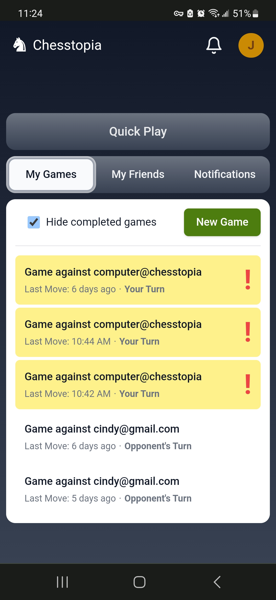
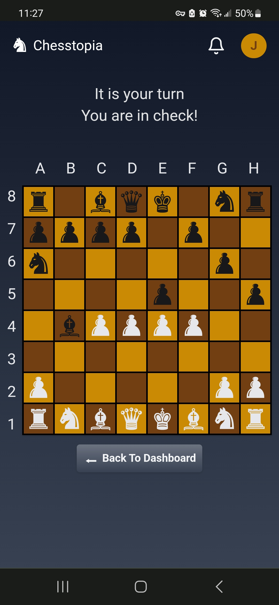

# Chesstopia
### Description
- Chesstopia is a website for users to play chess with friends or an AI opponent in real time over the web.

### Screenshots

### Project Goals
- Become familiar with Java and Spring framework
- Expand knowledge of OOP principles
- Become familiar with websockets and which situations they are most practical for
### Features
- Mobile-first UI
- Authorization/Authentication 
- Through the use of websockets games can be played in real-time and users can be notified of updates to ongoing games.
- A matchmaking system which places users in a lobby and immediately matches them and starts a new game with any other players who have also entered the matchmaking lobby.
-  An AI opponent which can be challenged from the matchmaking("Quick Play") lobby.
### Technologies Used
- React
- Java/Spring Boot
- PostgreSQL 
- Apache Tomcat

### AI Capabilities
- The computer AI is very basic.  It will make a random move for a random piece. However, it will always prioritize moves that result in checkmate, check, or the loss of a piece for the opposing player (the user) in that order.
